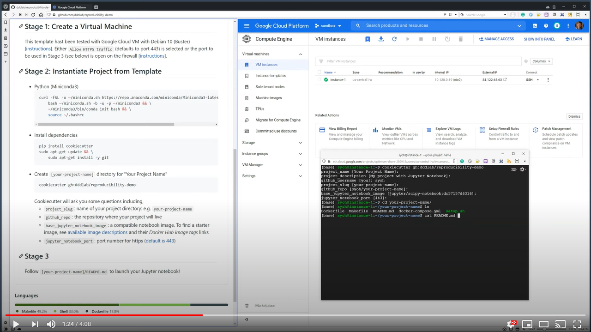

# Data Science Project Template

A [cookiecutter](https://github.com/cookiecutter/cookiecutter) template for creating a data science project repository.

This template makes it easy to start your Jupyter notebook on a cloud VM. The following instructions have been tested on Google Cloud Platform with Debian 10.

[](https://www.youtube.com/watch?v=9uT48PKhcZo)

There are three stages in deploying your own Jupyter notebook on the cloud.

1. Stage 1: Create a virtual machine and login using ssh
2. Stage 2: Use `cookiecutter` to start your project directory
3. Stage 3: From inside your project directory, configure and run your Jupyter notebook

## Stage 1: Create a Virtual Machine

This template hast been tested with Google Cloud VM with Debian 10 (Buster) [[instructions](https://cloud.google.com/compute/docs/quickstart-linux)]. Either `Allow HTTPS traffic` (defaults to port 443) is selected or the port to be used in Stage 3 (see below) is open on the firewall [[instructions](https://cloud.google.com/vpc/docs/using-firewalls)].

## Stage 2: Instantiate Project from Template

* Python (Miniconda3)
    ```bash
    curl -fSL -o ~/miniconda.sh https://repo.anaconda.com/miniconda/Miniconda3-latest-Linux-x86_64.sh && \
        bash ~/miniconda.sh -b -u -p ~/miniconda3 && \
        ~/miniconda3/bin/conda init bash && \
        source ~/.bashrc
    ```
* Install dependencies  
    ```bash
    pip install cookiecutter
    sudo apt-get update && \
        sudo apt-get install -y git
    ```
*  Create `[your-project-name]` directory for "Your Project Name"  
    ```bash
    cookiecutter gh:dddlab/reproducibility-demo
    ```
    Cookiecutter will ask you some questions including, 
    * `project_slug`: name of your project directory: e.g. `your-project-name`
    * `github_repo`: the repository where your project will live
    * `base_jupyter_notebook_image`: a compatible notebook image. To find a starter image, see [available image descriptions](https://jupyter-docker-stacks.readthedocs.io/en/latest/using/selecting.html#core-stacks) and their _Docker Hub image tags_ links
    * `jupyter_notebook_port`: port number for https ([default is 443](https://www.lifewire.com/what-is-port-443-4690657))

## Stage 3

Find `README.md` in `[your-project-name]` directory for instructions on how to launch your Jupyter notebook!
